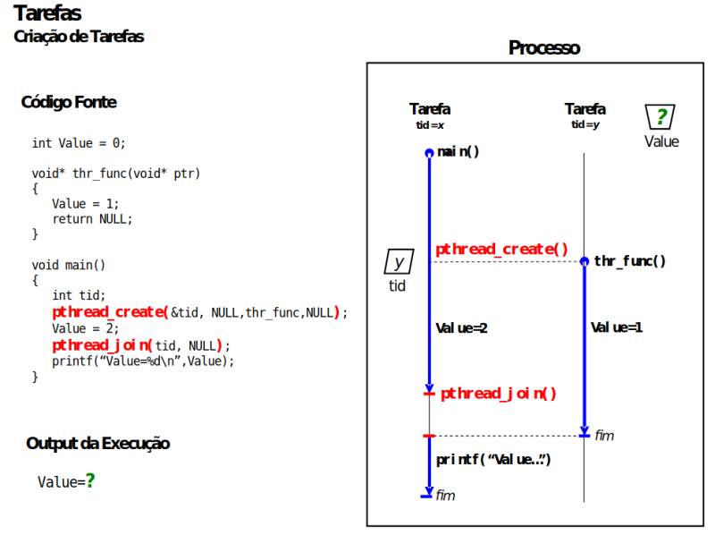

# Guião sobre programação com tarefas 

  

## Objetivos

No final deste guião, deverá ser capaz de:

* criar tarefas (*threads*) utilizando `pthread_create` e esperar pela sua terminação utilizando `pthread_join`;
* observar como a ordem de execução de tarefas concorrentes pode afetar o resultado de um programa, mesmo que só em algumas execuções;
* comparar tarefas com processos.


## Introdução

Muitos programas precisam de executar várias funções ao mesmo tempo.
Por exemplo, uma aplicação pode estar a processar dados enquanto recebe novos comandos.
Para dar resposta a este tipo de execução concorrente, dentro do mesmo processo, foram propostas as tarefas, em inglês, *threads*[^thread-fio].

[^thread-fio]: *thread* é fio em inglês.
Neste contexto, pode dizer-se fio de execução.
Cada *thread* representa um percurso sequencial de execução através das instruções do programa, podendo coexistir vários "fios" num mesmo "tecido", correspondente à aplicação como um todo.

As tarefas ao mesmo processo partilham os recursos desse processo, incluindo o seu espaço de endereçamento. 
Esta partilha facilita a comunicação entre tarefas, mas significa também que é necessário ter cuidado quando várias tarefas acedem simultaneamente às mesmas variáveis.

Neste guião vamos ver exemplos de código e depois teremos um exercício.

### Antes de começar

Para os exemplos e o exercício vai precisar de um sistema operativo compatível com POSIX, de preferência um Unix, como o Ubuntu Linux ou outro.
Se ainda não o tiver disponível no seu computador pessoal, pode utilizar um dos computadores do laboratório.

Para obter os exemplos de código, clone este repositório, usando o comando: ``git clone https://github.com/tecnico-so/lab_tarefas.git``

## Tarefas

Uma tarefa (*thread*) é uma sequência de instruções que pode ser executada concorrentemente dentro de um processo.
 
Comece por abrir o ficheiro `src/thread.c`.
Este programa cria várias tarefas utilizando a biblioteca POSIX Threads (abreviado por *pthreads*).

### 1. Análise inicial

Antes de executar o programa:

**a)** Identifique as chamadas a [`pthread_create`](https://man7.org/linux/man-pages/man3/pthread_create.3.html) e determine quantas tarefas serão criadas.

**b)** Identifique a função que será executa por cada nova tarefa.

**c)** Identifique os dados que serão partilhados entre as tarefas.

**d)** Preveja a informação que deverá ser apresentada no terminal.

**e)** Para que vai servir a chamada a [`pthread_join`](https://man7.org/linux/man-pages/man3/pthread_join.3.html)?

### 2. Compilação e execução

Compile e execute o programa:

```console
cd src
make
./thread
```
Repita a execução várias vezes.

Compare os resultados observados com a previsão efetuada anteriormente.

### 3 Interpretação dos resultados

Consulte o seguinte diagrama:



As tarefas partilham a variável global `g_value`.

Porque razão diferentes execuções do programa podem produzir diferentes valores para `g_value`?

### 4. Repetir vezes suficientes até observar valor diferente

Na aparência, pode acontecer que o programa produz sempre o mesmo resultado.

Vamos repetir a execução várias vezes consecutivas para tentar observar o resultado diferente.

Com a seguinte sintaxe pode repetir um mesmo comando, representado por `your_command`, dez vezes.

```sh
for i in {1..10}; do your_command; done
```

Vamos executar o nosso exemplo dez vezes.

```sh
for i in {1..10}; do ./thread; done
```

Surgiu alguma execução diferente?
Se ainda não, incrementar para 100.

```sh
for i in {1..100}; do ./thread; done
```

E agora? Se ainda não, incrementar para 1000.
Neste caso, vamos usar o comando `grep` para filtrar o resultado para aparecer apenas o resultado diferente, caso aconteça.

```sh
for i in {1..100}; do ./thread; done | grep 2
```

Se 1000 não for suficiente, continue a incrementar o número de repetições.

### 5. Influenciar a ordem de execução

Para tornar as diferentes ordens de execução mais fáceis de observar, podemos introduzir, provisoriariamente, chamadas a [`sleep`](https://man7.org/linux/man-pages/man3/sleep.3.html) em diferentes pontos do programa.

O objetivo é fazer uma chamada a `sleep` para suspender temporariamente a tarefa que a executa, dando oportunidade para outras tarefas se executarem.

Introduza o `sleep`, recompile e teste novamente o programa.

**Nota importante:** O uso de `sleep` permite influenciar o comportamento observado, mas não constitui um mecanismo correto de sincronização entre tarefas.
Estes mecanismos de sincronização serão vistos mais tarde, noutro guião.


## Conclusão

Neste laboratório vimos como se podem criar tarefas dentro de um processo, com `pthread_create`.
`pthread_join` permite esperar pela terminação de uma outra tarefa.

As experiências, sobretudo as repetições, mostraram também uma propriedade fundamental da programação concorrente: quando várias tarefas acedem aos mesmos dados, a correção do programa não pode depender de uma ordem de execução, ainda que tenha boas probabilidades de acontecer.

Vimos como `sleep` pode tornar certas ordens mais prováveis  de observar mas **não resolve** o problema geral de coordenar acessos concorrentes a dados partilhados. 
Para isso serão necessários mecanismos de sincronização.
